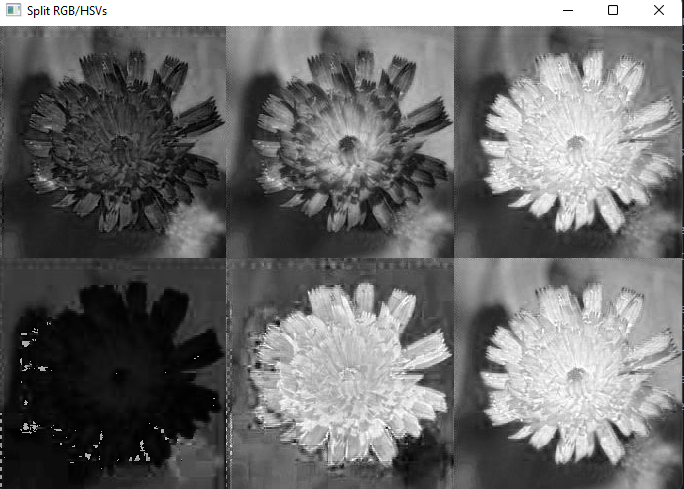
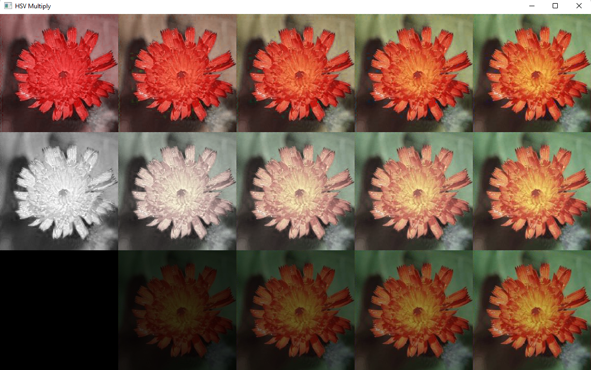
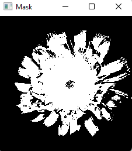
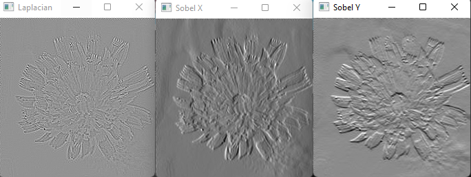
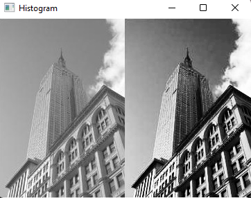

# CGRA352 Assignment 1 Report
##### Clara Ge 300515999
---  

## Introduction
In *work/src* folder, there are three files: `Main.cpp`, `ImageProc.h` and `ImageProc.cpp`. In `ImageProc.cpp` there are 6 functions:
``` C++
// Core 1
cv::Mat separate_RGB_HSV(cv::Mat& img);
// Core 2
cv::Mat HSV_multiply(cv::Mat& img);
// Core 3
cv::Mat Euclidean(cv::Mat& img);
// Completion, calculates 3 different filters in calculateFilter
// and apply then in one function to avoid duplicate codes
cv::Mat applyFilter(cv::Mat& img, std::string method);
cv::Mat calculateFilter(cv::Mat padded, cv::Mat kernel);
// Challenge
cv::Mat Histogram(cv::Mat& img);
```
In `Main.cpp`, there are 3 functions:
``` C++
void reload_img(cv::Mat& img); // reloads image
void load_default(cv::Mat& img, std::string name); // loads default images
int main(int argc, char* argv[]); 
```

---
## How to run the program
After running the `Main.cpp`, there is a terminal UI waiting for input. You can either hit **enter** or **a path to an image**, **enter** will load the default image. The following commands will be lists for you to put:
- core1
- core2
- core3
- comp (loads all three results for completion)
- chag (challenge)
- reload (reload an image)
- exit 

*You can hit any key to close all windows*

---
# Results
Here are the results after running core, completion and challenge:
{width=200}
{width=200}
{width=100}  

{width=300}
{width=200}
