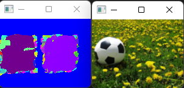

# CGRA352 Assignment 2 Report
##### Clara Ge 300515999
---  

## Introduction
In *src* folder, there are six files: `main.cpp`, `main.h`, `patchMatch.cpp`, `patchMatch.h`, `quilting.cpp` and `quilting.h`.

The core and challenge are done in `patchMatch`, with the following functions:
``` C++
// core function, arg show is a boolean to determine 
// whether to show image in each iteration
// nnf stores the offset vectors
cv::Mat patchmatch(Mat source, Mat target, int patch_size, int iterations, 
        Mat nnf, bool show);
// challenge function
cv::Mat reshuffle(Mat source, Mat mask, int patch_size, 
        int patchmatch_iter, int pyramid_depth, int correct_iter);
// helper functions
// improve one value in nnf mat with the new offset candidate
void improve_nnf(Vec2i offset, Vec2i tp, Mat source, Mat target, 
                Mat nnf, Mat cost, int patch_size);
// random search function, finding a absolute coordinate 
// randomally and see if that is better
void random_search(Mat source, Mat source_buffer, Mat target_buffer, 
                    int patch_size, Mat nnf, Mat cost);
// display image
void show_imgs(Mat source, Mat nnf, int iteration, bool show);
cv::Mat nnf2img(Mat nnf, Size s);
// enlarge the size of nnf to the size of the arg size
cv::Mat upsampleNNF(Mat nnf, Size size);
// reconstruct for core
cv::Mat reconstruct(Mat source, Mat nnf);
// reconstruct for challenge with the patch_size_
cv::Mat reconstruct(Mat source, Mat nnf, int patch_size);
// whether the vector is inside the mat
bool contains(Mat m, Vec2i v);
```

In `quilting`, there are 3 functions:
``` C++
// overall method for image quiilting
void quilting(Mat source, int patch_size, int overlap);
// horizontal quilting
Mat hquilt(Mat left, Mat right, int overlap, int SeamDraw);
// find three neighbours that are one row above the current position
Vec2i find_min_neigh_up(Mat map, int i, int j);
```

In `main`, there are 4 functions:
``` C++
void reload_img();
void load_default(std::string str);
void validate_input(cv::String input, cv::Mat img);
int main(int argc, char* argv[]); 
```

---
## How to run the program
After running the `Main.cpp`, there is a terminal UI waiting for input. You can either hit **enter** or **manually input the path of images for each section**, **enter** will load the default image. The following commands will be lists for you to put:
- core
- comp
- chag
- reload (reload an image)
- exit 

*You can hit any key to close all windows or close all windows manually*<br>
*For changing the patch size or iterations, it can be changed in the `main.cpp` where the functions are called* <br>

**Core and Challenge has different steps and shows the images in each iteration, for larger images the processing time takes longer**

---
# Results
Here are the results after running core, completion and challenge:
Initalization

Iteration 1

Iteration 2

Iteration 3


<br>
Iteration 1<br>
<br>
Iteration 2<br>
<br>
Iteration 3


